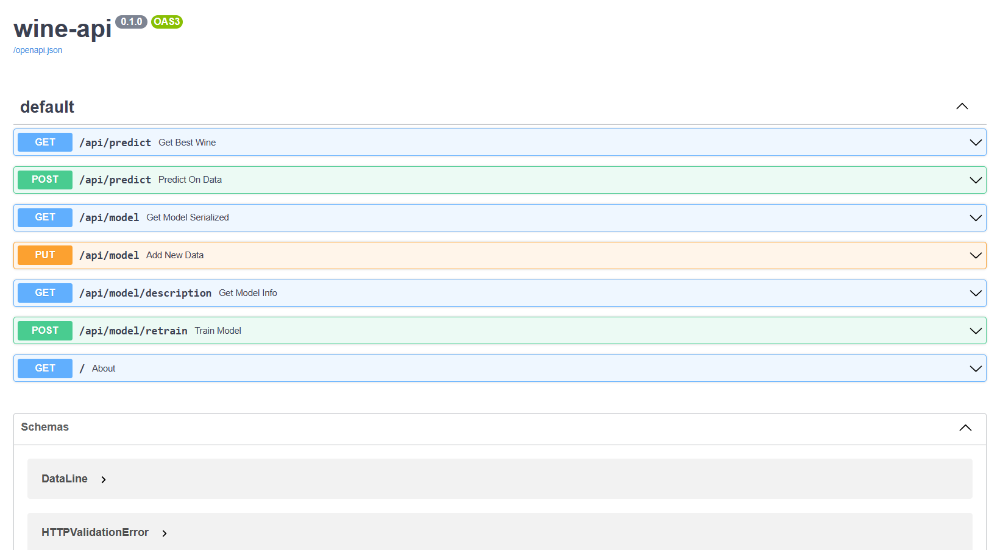

# Wine API
## By Grosperrin Mathis and Mourareau Noa


## Overview

This is an AI-based project to determine which wine composition is the best.
The dataset used for training the model is available in the [data](data/) directory of this git repository.

This project use [FastAPI](https://fastapi.tiangolo.com/) framework to create the API which interact with the [scikit-learn](https://scikit-learn.org/stable/) AI-model

## Installation

To install all the requirements, use the package manager [pip](https://pip.pypa.io/en/stable/) and type this in your terminal.

## Launch the app
```
unzip the file
create your virtualenv
pip install -r /path/to/requirements.txt
uvicorn app.main:app --reload --port 8000
```

If you want to change the port, you can change the 8000 value by the port you want.

This command should create the local server on your computer with the app running on it.

Then, to visualize and test all the endpoints and the API routes available, go to [http://localhost:8000/docs](http://localhost:8000/docs) and you should see the swagger page like this :



You can also see a more detailled documentation at [http://localhost:8000/redoc](http://localhost:8000/redoc) like :


## Model construction
### Dataset
To build our model, we took the data from the csv file `Wines.csv` and deleted the unecessary "id" column. 

### Find the best wine
To detect the components of the perfect wine, we have thinked about taking all the wines with the best quality (8) and simply calculate the mean of all their caracteristics to generate our perfect wine with a quality of 10. Moreover, with some observations about feature importance, we noticed that the variables with the biggest weight for the quality prediction were : alcohol, sulphates and volatile acidity.


### Model
For the prediction we used the scikit learn module "SVC" that gave us better results than the Random Forest Classifier in terms of recall, F1 and precision score. In this data-exploration folder, you can find a notebook where we tried to find the best model and the optimal hyperparameters with "GridSearchCV" function.

### Serialization
We have already trained the model with a Support Vector Classifier. You can check the different metrics and hyperparameters that we used at the dedicated API route (GET /api/model/description). We have chosen the pickle module to keep the model encapsulated (serialized) after every retraining. The model persists on the disk so we don't need to train the model every time we launch the app.

## Project Architecture
### Description and technical choices

We have chosen to separate the different routes (/routes), classes (/classes), configuration (/core), model informations and serialization (/models) and AI model construction files (/scripts) for better readability. You can see the architecture of the project below
```
wine-api
│   README.md
│   .gitignore
│   requirements.txt
└─── app
│    │   main.py
│    └─── classes
│    │   │   models.py
│    │ 
│    └─── core
│    │   │   config.py
│    │ 
│    └─── models
│    │   │   metrics.json
│    │   │   model.pkl
│    │ 
│    └─── routes
│    │   │   model.py
│    │   │   predict.py
│    │ 
│    └─── scripts
│    │   │   model_tools.py
│    │   │   predict_tools.py
│    │   
└─── assets
│    │  Scikit_learn_logo_small.svg.png
│    │  fastapi-logo.png
│    │  redoc.png
│    │  swagger.png
│
└─── data-exploration
│    │  data_explo.ipynb
│
└─── data
│    │  Wines.csv
│
```
Check out the docstring documentation inside the different python files presented above to better understand the role of every code block.
inside the differee to better understand the role of every code block.
